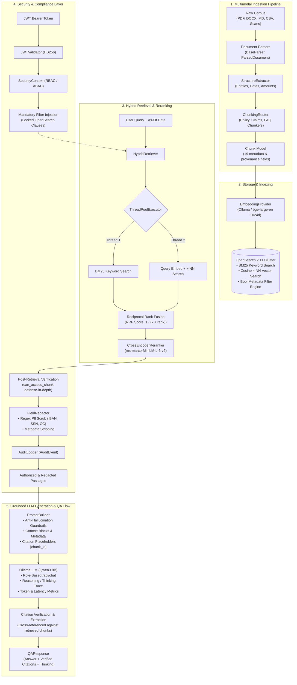

# Insurance Support Agent — Enterprise RAG Platform

Enterprise Retrieval-Augmented Generation (RAG) platform for **Meridian Mutual Insurance SE**, built on the multimodal **Strata Insurance Corpus** (1,311 documents across policies, claims, FNOLs, knowledge base manuals, tabular registers, and scanned evidence).

The platform features an end-to-end production-grade pipeline: domain-specialized ingestion, parallel hybrid search (BM25 + Dense Vector), Reciprocal Rank Fusion (RRF), Cross-Encoder reranking, version-aware temporal retrieval, and a 4-tier defense-in-depth security layer (JWT AuthN, RBAC/ABAC AuthZ, regex PII redaction, and audit logging).

---

## 📋 Table of Contents

1. [System Architecture](#system-architecture)
2. [Completed Capabilities & Implementation Steps](#completed-capabilities--implementation-steps)
   - [Step 1: Dataset & Corpus Integration](#step-1-dataset--corpus-integration)
   - [Step 2: Environment & Dependency Configuration](#step-2-environment--dependency-configuration)
   - [Step 3: Application & Package Architecture](#step-3-application--package-architecture)
   - [Step 4: Strongly-Typed Domain Models (Pydantic V2)](#step-4-strongly-typed-domain-models-pydantic-v2)
   - [Step 5: Multimodal Document Parsers](#step-5-multimodal-document-parsers)
   - [Step 6: Structure & Metadata Extraction](#step-6-structure--metadata-extraction)
   - [Step 7: Domain-Specific Chunking Strategies](#step-7-domain-specific-chunking-strategies)
   - [Step 8: Vector Embeddings Infrastructure](#step-8-vector-embeddings-infrastructure)
   - [Step 9: Storage & Search Infrastructure (OpenSearch k-NN)](#step-9-storage--search-infrastructure-opensearch-k-nn)
   - [Step 10: Hybrid Retrieval Layer (BM25 + Dense Vector + RRF)](#step-10-hybrid-retrieval-layer-bm25--dense-vector--rrf)
   - [Step 11: Cross-Encoder Reranking Layer](#step-11-cross-encoder-reranking-layer)
   - [Step 12: Version-Aware & Temporal Point-in-Time Retrieval](#step-12-version-aware--temporal-point-in-time-retrieval)
   - [Step 13: Enterprise Authentication, Authorization & Redaction](#step-13-enterprise-authentication-authorization--redaction)
3. [Repository Structure](#repository-structure)
4. [Security & Access Control Model](#security--access-control-model)
5. [Quickstart & Usage Guide](#quickstart--usage-guide)
   - [1. Prerequisites & Installation](#1-prerequisites--installation)
   - [2. Starting OpenSearch](#2-starting-opensearch)
   - [3. Code Example: Secure Retrieval Flow](#3-code-example-secure-retrieval-flow)
6. [Testing & Quality Assurance](#testing--quality-assurance)

---

## System Architecture



---

## Completed Capabilities & Implementation Steps

### Step 1: Dataset & Corpus Integration
- Downloaded and verified the synthetic **Strata Insurance Corpus** under `insurance-support-agent/data/raw/`:
  - **1,311 documents** across 5 categories: `claim`, `policy`, `kb`, `tabular`, `identity`, plus `evidence` and `faces`.
  - Multi-format coverage: PDF, Word (`.docx`), Markdown (`.md`), Excel (`.xlsx`), CSV, and scanned JPGs.
  - Entity models and ground truth: `model.json`, `manifest.json`, `model.schema.json`, and `golden.jsonl`.

### Step 2: Environment & Dependency Configuration
- Python 3.11 virtual environment configured with Poetry:
  - `pydantic (>=2.13.5)`: Strongly-typed data validation and serialization.
  - `huggingface-hub (>=1.31.0)`: Corpus integration.
  - `pymupdf (>=1.28.2)`: High-performance PDF parsing and text extraction.
  - `sentence-transformers (>=6.0.1)`: Dense embeddings and cross-encoder reranking.
  - `pyjwt (>=2.14.0)`: Enterprise JWT authentication and claims validation.
  - `pytest (>=9.1.1)`: Automated unit, integration, and regression testing.

### Step 3: Application & Package Architecture
- Modular architecture under `insurance-support-agent/`:
  - `apps/ingestion/`: Parsers, chunking strategies, structure extraction, and OpenSearch vector store indexing.
  - `apps/retrieval/`: Parallel hybrid search (BM25 + k-NN), Reciprocal Rank Fusion, temporal filters, and Cross-Encoder reranking.
  - `apps/auth/`: JWT validation, security context, secure retrieval wrapper, PII regex scrubbers, and audit logging.
  - `apps/agent/`: Orchestration and agent workflows.
  - `apps/api/`: REST API service.
  - `infra/`: Docker Compose cluster definitions and OpenSearch index mappings.

### Step 4: Strongly-Typed Domain Models (Pydantic V2)
- Implemented in `apps/ingestion/models.py`:
  - **Enums**: `DocumentType` (25+ document types), `SourceType`, `LineOfBusiness` (with aliases `motor`, `household`, `commercial`), `Status`, and `AccessLevel`.
  - **`Chunk` Model (19 fields)**: Mandatory `content`, `chunk_id`, `document_id`, `document_type`, `source_type`; optional entity scopes (`policy_id`, `claim_id`, `policyholder_id`); temporal boundaries (`effective_from`, `effective_to` with range validation); structural markers (`section`, `page_number`); and security tags (`access_control`, `source_uri`, `ingested_at`).

### Step 5: Multimodal Document Parsers
- Created `apps/ingestion/parsers/`:
  - `ParsedDocument` and `ParsedPage` domain models for normalized multi-page document representations.
  - `DocumentParser` (`@runtime_checkable` Protocol) and `BaseParser` (ABC with automatic file extension matching).
  - Concrete parsers for Markdown, PDF (PyMuPDF), and structured data formats.

### Step 6: Structure & Metadata Extraction
- Implemented `apps/ingestion/structure/`:
  - `StructureExtractor`: Rule-based and pattern-based entity extraction.
  - Automatically identifies policy numbers, claim references, dates of loss, deductible amounts, premium figures, and coverage types from unstructured text.

### Step 7: Domain-Specific Chunking Strategies
- Implemented `apps/ingestion/chunking/`:
  - `PolicyChunker`: Preserves hierarchical contract structure, section boundaries, and coverage tables.
  - `ClaimsChunker`: Preserves chronological FNOL timelines, adjuster notes, and estimate line items.
  - `FAQChunker`: Semantic question-and-answer boundary chunking for knowledge base articles.
  - `ChunkingRouter`: Dynamically inspects `DocumentType` and routes documents to their optimal chunker.

### Step 8: Vector Embeddings Infrastructure
- Implemented `apps/ingestion/embeddings/`:
  - `EmbeddingProvider` Protocol defining `embed_text()` and `embed_batch()`.
  - `OllamaEmbeddingProvider`: Local inference embedding provider (e.g. `bge-large-en-v1.5`, 1024-dimensional vectors).
  - `SentenceTransformersEmbeddingProvider`: In-process GPU/CPU embedding generation.

### Step 9: Storage & Search Infrastructure (OpenSearch k-NN)
- Implemented `apps/ingestion/indexing/`:
  - `OpenSearchIndexer`: Manages index lifecycle, batch indexing, document retrieval by ID, BM25 text queries, and k-NN vector queries.
  - Index schema configured with cosine similarity k-NN vector field (1024-d), standard analyzers for BM25 text search, and keyword fields for metadata filtering.

### Step 10: Hybrid Retrieval Layer (BM25 + Dense Vector + RRF)
- Implemented `apps/retrieval/`:
  - `RetrievalResult`: Standardized candidate model decoupling application consumers from OpenSearch JSON responses.
  - `reciprocal_rank_fusion()`: Combines sparse BM25 scores and dense vector rankings using $RRF(d) = \sum_{m} \frac{1}{k + r_m(d)}$.
  - `HybridRetriever`: Dispatches BM25 and vector searches concurrently via `ThreadPoolExecutor` and merges candidates with RRF.

### Step 11: Cross-Encoder Reranking Layer
- Implemented `apps/retrieval/rerank.py`:
  - `CrossEncoderReranker` utilizing `cross-encoder/ms-marco-MiniLM-L-6-v2`.
  - Scores query-chunk pairs jointly via cross-attention to resolve semantic subtleties missed by bi-encoders.
  - Min-max score normalization and top-$k$ candidate truncation.

### Step 12: Version-Aware & Temporal Point-in-Time Retrieval
- Implemented in `apps/retrieval/models.py`:
  - `RetrievalFilters` model supporting keyword and range filtering inside OpenSearch.
  - **Point-in-Time Queries (`as_of_date`)**: Translates a date (e.g., date of accident `2024-03-15`) into an OpenSearch boolean filter clause:
    - `effective_from <= as_of_date` AND (`effective_to >= as_of_date` OR `effective_to` does not exist).
  - Guarantees historical accident queries retrieve the policy version active on the loss date (e.g., v1), while general policy queries retrieve current in-force terms (e.g., v3).

### Step 13: Enterprise Authentication, Authorization & Redaction
- Implemented `apps/auth/`:
  - `JWTValidator`: Cryptographic signature verification (HMAC HS256), token expiry (`exp`), issuer (`iss`), and audience (`aud`) checks.
  - `SecurityContext`: Captures user identity, roles (`AccessLevel`), and entity scopes (`allowed_policy_ids`, `allowed_claim_ids`, `allowed_policyholder_ids`).
  - `SecureRetriever`: 4-stage defense-in-depth pipeline:
    1. **Mandatory Query Filtering**: Converts security scope to non-bypassable OpenSearch filter clauses.
    2. **Post-Retrieval Chunk Authorization**: Verifies each retrieved chunk against user permissions using `can_access_chunk()`.
    3. **Content Redaction (`FieldRedactor`)**: Regex scrubbing of sensitive PII (IBANs, credit cards, SSNs, phone numbers, emails) and role-based metadata stripping (e.g., hiding reserve amounts from policyholders).
    4. **Audit Logging (`AuditEvent`, `FileAuditLogger`)**: Compliance-ready audit trails recording user, query, applied filters, returned chunks, and blocked items.
  - **Unrestricted Admin Access**: Users with `AccessLevel.ADMIN` have zero mandatory filters, complete chunk access across all files (including untagged/restricted files), and bypass all redaction.

### Step 14: Qwen3 8B LLM Generation & Complete Grounded RAG Flow
- Implemented `apps/agent/`:
  - `LLMProvider` Protocol & `OllamaLLM`: Native connection to local `qwen3:8b` via Ollama `/api/chat`, supporting temperature controls, reasoning/thinking trace extraction (`LLMResponse.thinking`), and token/latency profiling.
  - `PromptBuilder`: Strictly grounded prompt engineering with anti-hallucination guardrails, structured context passages, and mandatory inline citation format `[chunk_id]` (e.g. `[DOC-C-1000-ESTIMATE#c3]`).
  - `RAGQuestionAnsweringFlow`: Complete end-to-end question-answering service:
    1. Authenticates user identity via `SecurityContext` or JWT bearer token.
    2. Executes secure hybrid retrieval, Cross-Encoder reranking, and PII redaction via `SecureRetriever`.
    3. Handles empty or access-denied retrieval gracefully without hallucinating or wasting LLM tokens.
    4. Passes sanitized context to Qwen3 8B for grounded synthesis.
    5. Extracts and verifies citations from the generated answer against retrieved source chunks, outputting a strongly-typed `QAResponse`.

---

## Repository Structure

```
.
├── pyproject.toml                         # Poetry dependencies & project configuration
├── poetry.lock
├── README.md                              # Main project documentation
├── apps/ -> insurance-support-agent/apps  # Convenience symlink for root-level imports
│
└── insurance-support-agent/
    ├── docker-compose.yml                 # OpenSearch 2.11 & Dashboards services
    ├── rag_qa_demonstration.txt           # Live Qwen3 8B end-to-end QA execution log
    │
    ├── apps/
    │   ├── agent/                         # Agent workflows and LLM orchestration
    │   │   ├── llm.py                     # LLMProvider protocol & OllamaLLM (Qwen3 8B)
    │   │   ├── models.py                  # ChatMessage, LLMResponse, Citation, QAResponse
    │   │   ├── prompt.py                  # PromptBuilder (anti-hallucination & citations)
    │   │   ├── qa_flow.py                 # RAGQuestionAnsweringFlow pipeline
    │   │   └── tests/                     # 20 automated agent & generation tests
    │   │
    │   ├── api/                           # FastAPI REST endpoints
    │   │
    │   ├── auth/                          # Enterprise Security & Compliance Layer
    │   │   ├── audit.py                   # AuditEvent and FileAuditLogger
    │   │   ├── jwt.py                     # JWTValidator and token helpers
    │   │   ├── models.py                  # SecurityContext, roles, domain exceptions
    │   │   ├── redaction.py               # FieldRedactor (PII regex + metadata stripping)
    │   │   ├── secure_retriever.py        # SecureRetriever wrapper
    │   │   └── tests/                     # 87 automated security tests
    │   │
    │   ├── ingestion/                     # Ingestion & Indexing Pipeline
    │   │   ├── chunking/                  # Policy, Claims, FAQ chunkers & router
    │   │   ├── embeddings/                # Ollama & SentenceTransformer providers
    │   │   ├── indexing/                  # OpenSearchIndexer and vector store abstractions
    │   │   ├── models.py                  # Pydantic V2 Chunk model & Domain Enums
    │   │   ├── parsers/                   # BaseParser, PDF & Markdown parsers
    │   │   └── structure/                 # StructureExtractor & entity recognition
    │   │
    │   └── retrieval/                     # Hybrid Search & Reranking Layer
    │       ├── fusion.py                  # Reciprocal Rank Fusion (RRF)
    │       ├── hybrid.py                  # HybridRetriever (parallel BM25 + k-NN)
    │       ├── models.py                  # RetrievalFilters & RetrievalResult models
    │       ├── rerank.py                  # CrossEncoderReranker
    │       └── tests/                     # 31 automated retrieval tests
    │
    ├── data/
    │   ├── raw/                           # Raw Strata corpus (1,311 documents)
    │   ├── processed/                     # Chunks & embeddings
    │   └── eval/                          # Golden evaluation sets
    │
    ├── infra/
    │   └── opensearch/                    # Mappings, index templates & analyzers
    │
    └── tests/                             # 167 unit & integration tests
        ├── test_chunk_model.py
        ├── test_chunking.py
        ├── test_document_model.py
        ├── test_embeddings.py
        ├── test_indexing.py
        ├── test_parsers.py
        └── test_structure_extractor.py
```

---

## Security & Access Control Model

| Role | Permitted Access Tiers | Entity Scope Enforcement | Redacted Metadata Fields | Content Redaction |
| :--- | :--- | :--- | :--- | :--- |
| **Policyholder** | `public`, `policyholder` | Restricted to own `policyholder_id` and assigned policies | Internal notes, reserves, adjuster reports, underwriting scores, commissions | Full PII scrubbing (IBAN, SSN, CC, etc.) |
| **Agent** | `public`, `policyholder`, `internal`, `agent` | Restricted to assigned `policyholder_ids` and policies | Reserve amounts, underwriting scores/notes, loss ratios | Full PII scrubbing |
| **Claims Adjuster** | `public`, `internal`, `agent`, `adjuster` | Restricted to assigned `claim_ids` | Underwriting scores/notes, agent commissions | Full PII scrubbing |
| **Underwriter** | `public`, `internal`, `agent`, `adjuster`, `underwriter` | Broad / Portfolio-level | Agent commissions | Full PII scrubbing |
| **Admin** | **All tiers** (`public`, `internal`, `confidential`, `restricted`, etc.) | **Unrestricted** (no filters forced, can view any files) | **None** (sees all metadata) | **Bypassed** (sees raw text & untagged documents) |

---

## Quickstart & Usage Guide

### 1. Prerequisites & Installation

- Python 3.11+
- [Poetry](https://python-poetry.org/)
- Docker & Docker Compose (for OpenSearch)

```bash
# Clone and navigate to repository
cd /path/to/RAG-setup

# Install dependencies using Poetry
poetry install
```

### 2. Starting OpenSearch

```bash
cd insurance-support-agent
docker compose up -d
```

Verify OpenSearch is healthy:
```bash
curl -X GET "http://localhost:9200/_cluster/health?pretty"
```

### 3. Code Example: Secure Retrieval Flow

```python
from datetime import date
from apps.auth import JWTValidator, SecureRetriever, FieldRedactor, FileAuditLogger
from apps.ingestion.indexing import OpenSearchIndexer
from apps.ingestion.embeddings import OllamaEmbeddingProvider
from apps.retrieval import HybridRetriever, CrossEncoderReranker

# 1. Initialize components
vector_store = OpenSearchIndexer(endpoint="http://localhost:9200", index_name="insurance_chunks")
embeddings = OllamaEmbeddingProvider(model_name="bge-large-en-v1.5", dimensions=1024)
reranker = CrossEncoderReranker(model_name="cross-encoder/ms-marco-MiniLM-L-6-v2")

retriever = HybridRetriever(
    vector_store=vector_store,
    embedding_provider=embeddings,
    reranker=reranker,
)

# 2. Wrap with enterprise security
secure_retriever = SecureRetriever(
    retriever=retriever,
    redactor=FieldRedactor(redact_pii=True),
    audit_logger=FileAuditLogger(log_path="audit.log"),
)

# 3. Authenticate incoming request token
jwt_validator = JWTValidator(secret_key="your-secure-secret-key-32-bytes-minimum")
token = "eyJhbGciOiJIUzI1NiIsInR5cCI6IkpXVCJ9..."
context = jwt_validator.validate(token)

# 4. Execute version-aware, authorized search
results = secure_retriever.retrieve(
    query="What is the net deductible payable for water damage?",
    context=context,
    top_k=5,
    as_of_date=date(2024, 3, 15),
    rerank=True,
)

for r in results:
    print(f"[{r.score:.4f}] {r.chunk_id}: {r.content[:100]}...")
```

### 4. Code Example: Complete RAG Question-Answering Flow with Qwen3 8B

```python
from datetime import date
from apps.agent import OllamaLLM, PromptBuilder, RAGQuestionAnsweringFlow
from apps.auth import FieldRedactor, JWTValidator, SecureRetriever
from apps.ingestion.embeddings import OllamaEmbeddingProvider
from apps.ingestion.indexing import OpenSearchIndexer
from apps.retrieval import CrossEncoderReranker, HybridRetriever

# 1. Build infrastructure & retrieval pipeline
indexer = OpenSearchIndexer(endpoint="http://localhost:9200", index_name="insurance_documents")
embedder = OllamaEmbeddingProvider(model_name="bge-m3")
reranker = CrossEncoderReranker(model_name="BAAI/bge-reranker-v2-m3")
hybrid = HybridRetriever(vector_store=indexer, embedding_provider=embedder, reranker=reranker)
secure_retriever = SecureRetriever(retriever=hybrid, redactor=FieldRedactor())

# 2. Initialize Qwen3 8B LLM and RAG flow
llm = OllamaLLM(model_name="qwen3:8b", base_url="http://localhost:11434")
validator = JWTValidator(secret_key="production_secret_key_insurance_agent_32b")
qa_flow = RAGQuestionAnsweringFlow(retriever=secure_retriever, llm=llm, jwt_validator=validator)

# 3. Generate token for claims adjuster
token = validator.create_token(
    user_id="ADJ-104",
    roles=["adjuster"],
    claim_ids=["C-1000"],
)

# 4. Ask a grounded insurance question
response = qa_flow.answer(
    query="What is the net claim amount payable after the deductible for claim C-1000?",
    jwt_token=token,
    top_k=3,
)

print(f"Answer: {response.answer}")
print(f"Citations: {[c.chunk_id for c in response.citations]}")
print(f"Latency: {response.latency_seconds:.2f}s")
```

---

## Testing & Quality Assurance

The test suite contains **305 automated tests** covering models, parsers, extractors, chunkers, embeddings, indexing, retrieval, reranking, security, and the LLM generation layer:

```bash
poetry run pytest -v
```

### Test Breakdown by Subsystem

| Test Suite | Location | Tests | Scope |
| :--- | :--- | :--- | :--- |
| **Agent & Generation** | `apps/agent/tests/test_llm.py`, `test_prompt.py`, `test_qa_flow.py` | 20 | OllamaLLM client, thinking extraction, PromptBuilder, RAGQuestionAnsweringFlow, citation linking |
| **Authentication & Context** | `apps/auth/tests/test_jwt.py`, `test_security_context.py` | 49 | JWT tokens, signature tampering, expiry, role permissions, mandatory filters |
| **Redaction & Audit** | `apps/auth/tests/test_redaction.py` | 16 | PII regex patterns (IBAN, SSN, CC), role field stripping, admin bypass |
| **Secure Retriever** | `apps/auth/tests/test_secure_retriever.py` | 22 | Filter merging, post-retrieval validation, cross-role data isolation, admin access |
| **Retrieval & RRF** | `apps/retrieval/tests/test_retrieval.py` | 15 | Parallel BM25 + vector search, RRF score computation, filter injection |
| **Cross-Encoder Reranking** | `apps/retrieval/tests/test_rerank.py` | 10 | Cross-encoder inference, score normalization, candidate pool truncation |
| **Version-Aware Retrieval** | `apps/retrieval/tests/test_version_retrieval.py` | 6 | Point-in-time `as_of_date` query generation, historical vs current versions |
| **Chunking & Routing** | `tests/test_chunking.py` | 10 | Policy, Claims, FAQ chunkers, ChunkingRouter dispatch |
| **Document Parsers** | `tests/test_parsers.py` | 24 | PDF, Markdown, text extraction, page tracking, error handling |
| **Structure Extractor** | `tests/test_structure_extractor.py` | 19 | Entity recognition (policies, claims, dates, currencies, coverages) |
| **Chunk Data Model** | `tests/test_chunk_model.py`, `test_document_model.py` | 91 | Pydantic V2 validation, enum constraints, date logic, access control |
| **Indexing & Embeddings** | `tests/test_indexing.py`, `test_embeddings.py` | 23 | Vector storage, k-NN queries, embedding provider contracts |
| **Total** | | **305** | **100% passing** |
